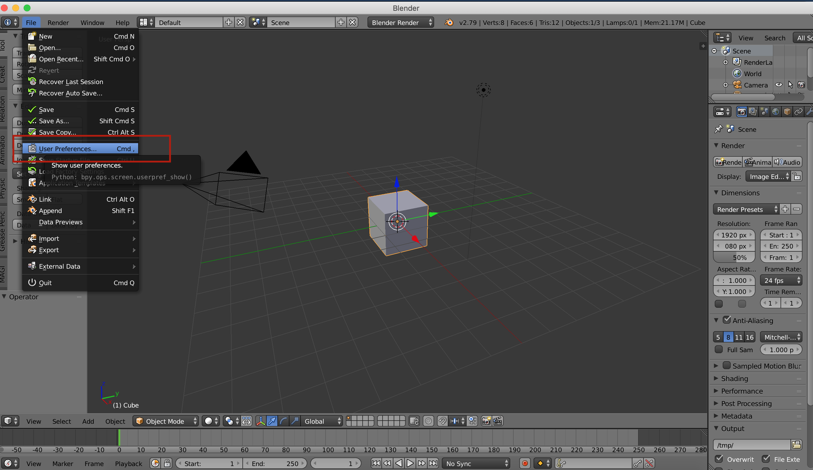
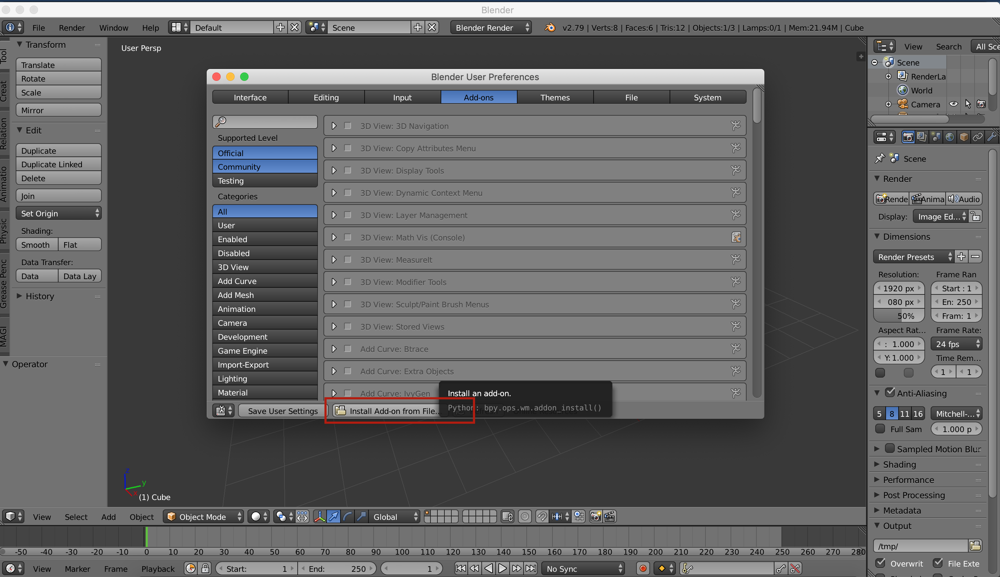
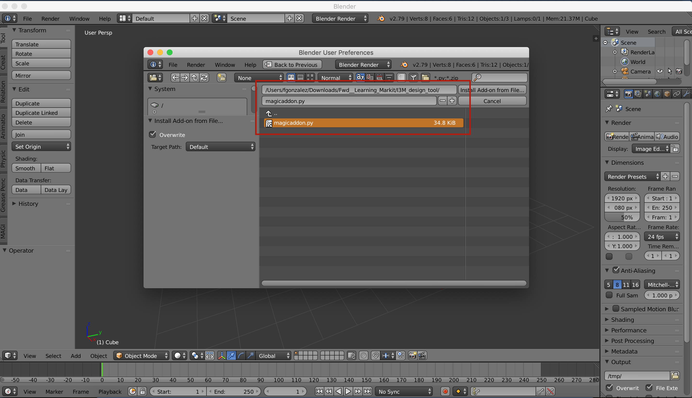
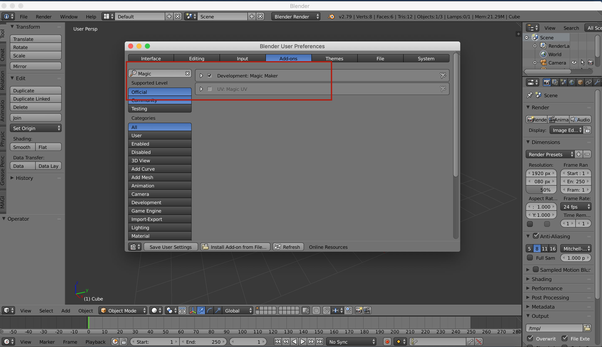
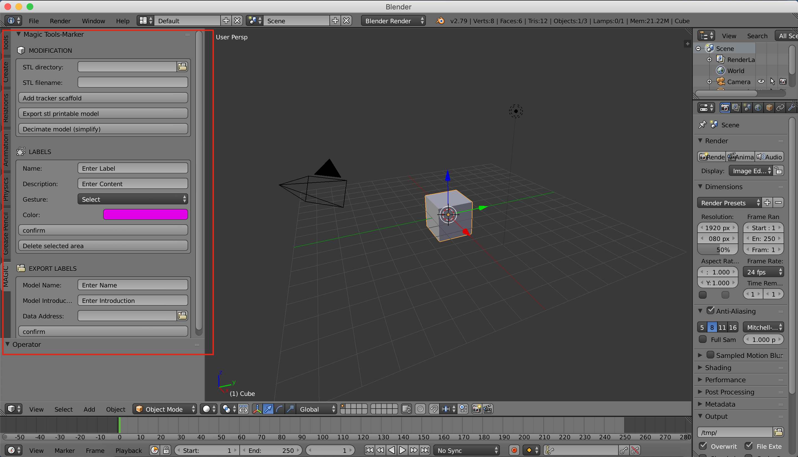
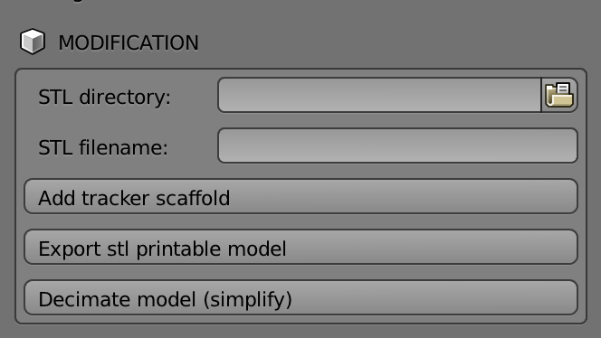
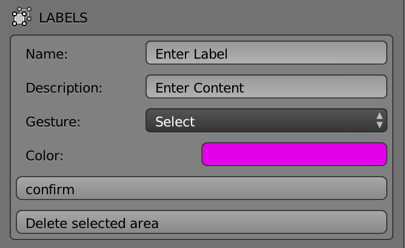
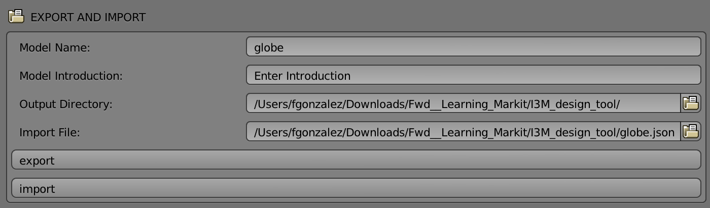
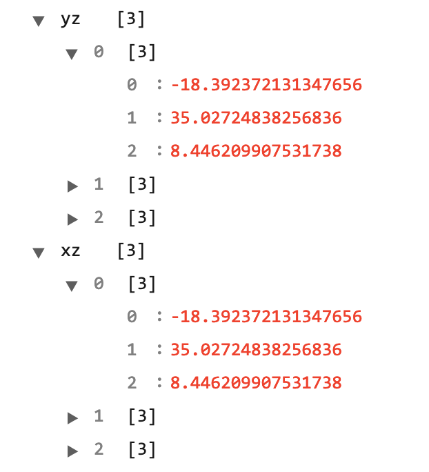
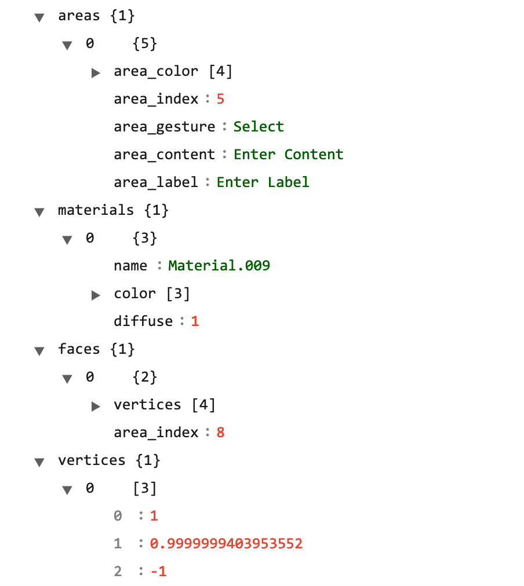

# MAGIC_I3M
MAGIC_I3M is a blender add-on in which users can label 3d models to make them interactable with Talkit ++, an application that plays audio and visual content as a user touches parts of a 3D print. For more information, check out: [Talkit++](https://github.com/saltfishzzh/Talkit)

## Dependencies

You should be using these tools:

1. Blender 2.78

### Install
To install the add-on you only need the vanilla version of Blender to start labelling models!

## Addon installation
This section covers briefly how to install an add-on in Blender:

- On the top left corner of your screen click the file tab and then go to your user preferences, 

- Click the button install add-on from file, 

- Look for the add-on file in your computer (Usually under downloads or where you cloned the project), 

- Finally, look for the add-on and activate it 

If you did everything correctly, you should be able to see this tool kit (using the default interface):

### Getting Started
- Explain how to use the tool and what does it work for.

## Usage

The addon contains 3 modules with 7 functionalities:

### Modification module

In this module you have access to 3 functionalities:
- Adding the tracker scaffold. This tracker scaffold needs to be added to every model in blender so we can map the model with talkit++ and make the model detectable.
- Exporting to an stl file. STL is the standar format used for 3D printing
- Decimate model. This function allows us to simplify the model being used, making it lightweight and easy to use. (Note: Don't use this function after adding the tracker scaffold!)

### Labeling module

In this module you have access to 2 functionalities:
- You can select any number of faces on the model and add a label by inputing a name, a description and selecting a color and then clicking on the confirm button. A label will be created and automatically linked to the selected faces.
- You can select any number of faces on the model and click on the delete selected area button. You only need to select 1 face of the corresponding area to delete that label. E.G: You select 3 faces of your object and label them, then you want to delete this action. You select only 1 of the previously labeled faces and click on the delete button. Finally all the 3 faces should lose their color, indicating that the label was deleted.

### Export and import module

In this module you have access to 2 functionalities:
- You can export the selected (1) object as a json file to share your work with other designers and users, so they can reuse and relabel your model.
- You can import a model providing a json file with the format explained above. You only need to provide the file path in your computer and click the import button.

## Implementation
### JSON data structure
There are 2 important sections in our json file.
#### XZ and YZ planes

We use these XZ and YZ planes (Composed of 3 vertices each one of them) so that talkit++ can use this constant point of reference to map the model and assign the audio labels in realtime.

TODO: Elaborate more in the explanation and show more images.
#### Vertices, faces, areas and materials.

To rebuild the model we need 4 pieces of information. 
- Vertices, which represent each point in the model. 
- Faces, which are composed with 3 or more vertices and make carcass of the model. 
- Materials, which help us with the labeling of the model (Gives color too). 
- Areas, which contain the information about the label

## Contact

If you have any question about using the project, please contact Lei Shi (ls776@cornell.edu) or Ricardo Gonzalez (rgonzalezp1115@gmail.com). They would be happy to explain the project to you.	

## Credits
This add-on was developed in Cornell Tech under professor Shiri Azenkot supervision.
